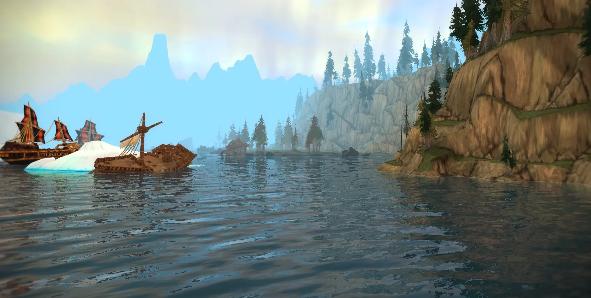

# wxl-modern-water

Modern water shading for the World of Warcraft 3.3.5a (build 12340) client, packaged as a
WarcraftXL extension. It is the water half of the former combined `wxl-vol-fog` module: the pipeline
is the CoAVolFog water code, loaded through WarcraftXL's extension loader and tuned from the
WarcraftXL overlay.



## What it does

- GPU FFT wave simulation (128 or 256), foam, sun highlights and zone colours from `waterdata.bin`.
- Ripples and wakes where players, creatures, pets and mounts move through water.
- Scene reflections, refraction and depth-aware absorption, drawn after the client's liquid pass.
- Settings panel on the WarcraftXL overlay under **Modern Water**.

Fog is a separate module (`wxl-vol-fog`). The two are mutually exclusive: each installs its own D3D9
device wrapper and engine call-site hooks, so only one may be loaded at a time.

## Layout

```
src/                 the CoAVolFog water sources, plus the shared engine/D3D9 layer and the WXL seam
shaders/             the HLSL passes the water renderer compiles and includes
data/                waterdata.bin
tools/               the Forever water data converter
module.cmake         fxc shader build + config/data deployment (picked up by the core build)
wxl-modern-water.ini default settings, also the players' documentation
```

## Building

Stage the module into the core's `extensions/` folder and build the named target:

```powershell
$name = "wxl-modern-water"
$dst  = "wxl-build\wxl-core\extensions\$name"
New-Item -ItemType Directory -Force -Path $dst | Out-Null
Copy-Item "modules\$name\*" -Destination $dst -Recurse -Force

cmake -S wxl-build\wxl-core -B wxl-build\wxl-core\build -A Win32
cmake --build wxl-build\wxl-core\build --config Release --target $name --parallel
```

`module.cmake` compiles the HLSL passes with `fxc` and deploys the ini and data files next to the
DLL. It needs the Windows SDK; set `-DVOLFOG_FXC=<path>` if `fxc.exe` is not found.

## License and credits

This module is derived from [CoAVolFog](https://github.com/jealous-sound/coa-vfog) by
jealous-sound: it reuses, modifies and extends that project's water-rendering code. The upstream
copyright and license therefore apply to the derived work.

`wxl-modern-water` is licensed under the **GNU General Public License version 3 only** (GPL-3.0-only); see
[`LICENSE`](LICENSE). As an additional permission under GPLv3 section 7, you may link or combine
this module, including modified versions, with the World of Warcraft client, and distribute the
resulting combination without providing the client's source code. GPLv3 continues to apply to this
module.

If you redistribute this module or a modified version of it, keep the license and copyright notices
intact, mark your changes with a relevant date, and provide the corresponding source under the same
terms. The full GPLv3 text is in [`LICENSE`](LICENSE).

## Notes

- The config and data are read from the extension DLL's own folder
  (`<client>\Extensions\wxl-modern-water\`), so a build that does not deploy them runs with defaults and no
  water data.
- The module logs to `wxl-modern-water.log` in that folder and to the core log.
